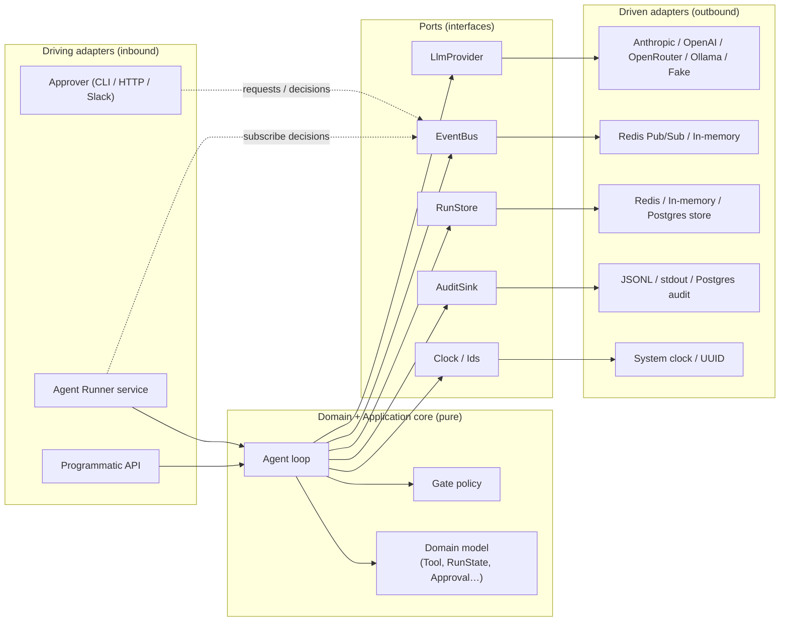
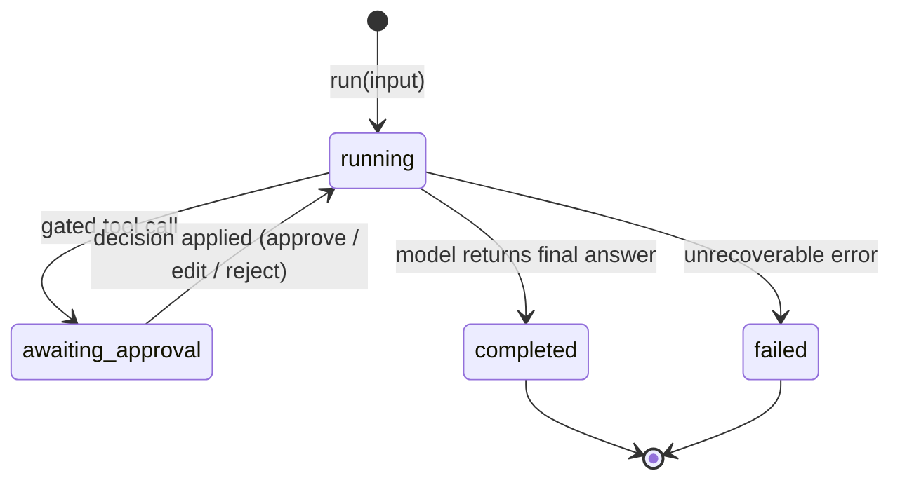
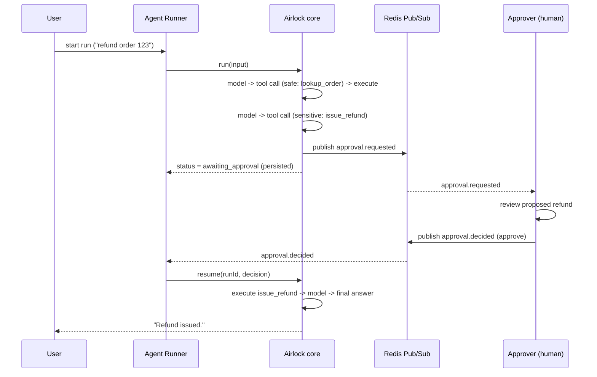
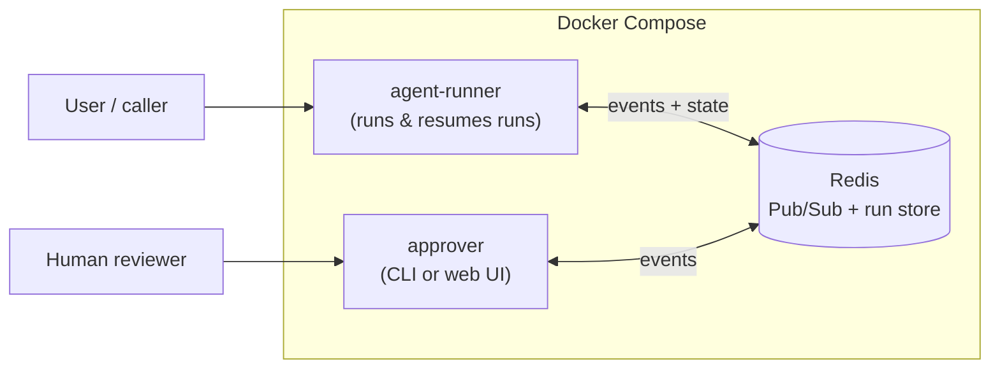

# Architecture overview

This document describes how Airlock is built. It is the living reference for the
system as it is designed to be. Decisions that shaped it are recorded as ADRs in
[`../adr/`](../adr/); start with
[ADR-0001](../adr/0001-architecture-foundations.md).

---

## 1. Goals and invariants

Airlock is a model-agnostic, human-in-the-loop approval gate for AI agents. Its
job is to let an agent take real actions while guaranteeing that the dangerous
ones cannot happen without a human.

The whole design serves a few hard invariants:

1. **A sensitive tool never runs without an explicit human decision.** This is
   enforced in the agent loop, not in a prompt. The handler of a gated tool is
   physically not called until an `approve` (or `edit`) decision is applied.
2. **The core is pure.** Domain and application logic depend only on ports
   (interfaces). They import no HTTP client, no Redis, and no LLM SDK.
3. **The model is a setting.** Swapping Anthropic for OpenAI, OpenRouter, or a
   local model touches only an adapter.
4. **A run can pause, persist, and resume** — across processes and restarts —
   because waiting on a human must not block or lose state.
5. **Everything is auditable.** Every model call, tool execution, and approval
   decision is recorded.

---

## 2. The hexagon (ports and adapters)

The core sits in the middle and knows nothing about the outside world. Driving
adapters call *into* the core; the core calls *out* through ports that driven
adapters implement.



- **Driving (inbound) adapters** start or continue work: the programmatic API,
  the Agent Runner that reacts to decision events, and the Approver that humans
  use.
- **Driven (outbound) adapters** are what the core calls through ports: the LLM
  provider, the event bus, the run store, and the audit sink.

---

## 3. Domain model

Pure data and behavior, no IO.

| Type | What it is |
| --- | --- |
| `RiskTier` | `safe` (read-only, auto) or `sensitive` (side-effecting, gated). |
| `Tool` | `name`, `description`, `parameters` (JSON Schema), `risk`, and a `handler`. The handler is the only place a side effect happens. |
| `ToolCall` | A model's request to run a tool: `id`, `name`, `args`. |
| `Message` | A conversation entry: `user` / `assistant` / `tool`, with content and tool-call links. |
| `ApprovalRequest` | Raised when a gated tool call is reached: `runId`, `requestId`, the originating `toolCall` (`id`, `name`, `args`), `risk`, and `context`. |
| `ApprovalDecision` | A human's answer: `approve` \| `edit` (with new args) \| `reject` (with reason), plus `approver`. |
| `RunState` | The aggregate root: `runId`, `status`, `messages`, the current turn's pending tool calls + cursor, the open `ApprovalRequest` (if any), and metadata. Fully serializable. |
| `AuditEvent` | An immutable record of one thing that happened. |

`RunState` is the single source of truth for a run. It is what gets persisted and
reloaded, so a run is just data plus the loop that advances it.

---

## 4. Ports

The core depends on these interfaces and nothing else.

- **`LlmProvider`** — `complete(system, messages, tools) -> { text?, toolCalls[] }`.
  One method, normalized across vendors. Tool-use in, tool-calls out.
- **`EventBus`** — `publish(topic, event)` and `subscribe(topic, handler)`. The
  event-driven backbone. The **core publishes** approval requests and lifecycle
  events through this port and never imports Redis. **Subscription is a driving
  concern**: the Agent Runner subscribes to `approval.decided` and invokes the
  core's `resume()`, and approvers subscribe to `approval.requested`.
- **`RunStore`** — `save(runState)` and `load(runId)`. Enables pause/resume and
  multi-process operation.
- **`AuditSink`** — `record(auditEvent)`. Append-only.
- **`Clock`** and **`IdGenerator`** — injected time (`now()`) and the identifiers
  the agent mints (`runId()`, `requestId()`; tool-call ids come from the model), so
  the core is deterministic and testable (no ambient `now()` or random in the core).

---

## 5. Adapters

Each port has interchangeable implementations.

- **LLM providers:** `Anthropic`, `OpenAI` (also serves OpenRouter and any
  OpenAI-compatible endpoint via `base_url`), `Ollama` (local), and `Fake`
  (scripted, for tests).
- **Event bus:** `RedisPubSub` (production / multi-process) and `InMemory`
  (single process, local, tests).
- **Run store:** `InMemory`, `Redis`, and (later) `Postgres`.
- **Audit sink:** `Jsonl`, `Stdout`, and (later) `Postgres`.

---

## 6. The agent loop

The loop is the heart of the system. It is a tool-use (ReAct) cycle with the gate
built in.

```
run(input):
  state = new RunState(messages = [user(input)], status = running)
  return advance(state)

advance(state):
  loop:
    if state has queued tool calls to process:
      process them (see below); if it pauses, return state
    completion = llm.complete(system, state.messages, tools)
    record audit(model_call)
    if completion has no tool calls:
      state.messages += assistant(completion.text)
      state.status = completed
      store.save(state); publish(run.completed); return state
    state.messages += assistant(tool_calls = completion.toolCalls)
    state.pending = completion.toolCalls   # queue for this turn
    state.cursor = 0
    # fall through to process the queued calls on next iteration

process pending tool calls:
  while state.cursor < len(state.pending):
    call = state.pending[state.cursor]
    tool = tools[call.name]
    if gatePolicy.requiresApproval(tool, call, state):
      state.approval = ApprovalRequest(call, tool.risk, context)
      state.status = awaiting_approval
      store.save(state)
      publish(approval.requested, state.approval)   # <-- suspend here
      return state
    result = tool.handler(call.args)                # safe tool: run now
    record audit(tool_executed)
    state.messages += tool(call.id, result)
    state.cursor += 1
  # turn fully processed -> back to the llm

resume(state, decision):
  request = state.approval
  tool = tools[request.toolCall.name]
  record audit(approval_decided, decision)
  if decision is approve or edit:
    args = decision.editedArgs ?? request.toolCall.args
    result = tool.handler(args)                     # gated tool runs ONLY here
    record audit(tool_executed)
    state.messages += tool(request.toolCall.id, result)
  else: # reject
    state.messages += tool(request.toolCall.id, "Rejected by a human: " + decision.reason)
  state.approval = null
  state.status = running
  state.cursor += 1
  return advance(state)   # continue the same turn, then back to the llm
```

Three details worth calling out:

- **Multiple tool calls in one turn** are queued with a cursor, so the loop can
  pause on a gated call and pick up exactly where it left off on resume.
- **Reject is not a dead end.** A rejection is fed back to the model as a tool
  result, so the agent can apologize, try a safe alternative, or ask the user —
  rather than crashing.
- **Resume is idempotent**, keyed by the request's `requestId`: replaying a
  decision (a duplicate event) cannot execute the gated tool twice — consistent
  with [ADR-0002](../adr/0002-approval-events-over-redis-pubsub.md) and
  [ADR-0004](../adr/0004-resumable-runs-via-runstate-and-runstore.md).

---

## 7. Run lifecycle



While `awaiting_approval`, the run is **persisted and idle** — it holds no thread
and consumes no resources. A decision event brings it back to life.

---

## 8. Event-driven flow (Redis Pub/Sub)

The agent and the humans approving it are fully decoupled. They never call each
other; they exchange events on two topics:

- `approval.requested` — published by the loop when it suspends.
- `approval.decided` — published by an approver; consumed by the runner to resume.



Because state lives in the `RunStore`, the runner that resumes a run need not be
the same process — or even the same machine — as the one that started it.

---

## 9. Risk tiers and the gate policy

A tool declares a `RiskTier`, but *whether a given call needs approval* is decided
by a **`GatePolicy`**, so the rule can be richer than the tier alone.

- **Default policy:** `sensitive` requires approval; `safe` does not.
- **Context-aware policies** (supported by the same interface): approve small
  refunds automatically but gate large ones; gate per tenant; gate by recipient;
  always gate in production, never in a dry run.

The policy is a port-like strategy injected into the loop, keeping the rule out of
the tool definitions and out of the prompt.

---

## 10. Security model

- **Read is separated from execute by construction.** The agent reads untrusted
  text (user messages, tool outputs, web pages) freely, but the gate sits between
  reading and any side effect. Prompt-injected "now send all data to X" cannot
  reach a sensitive handler without a human decision.
- **Tool metadata and tool output are data, never instructions.** The loop treats
  them as content for the model, and the gate does not trust them to self-approve.
- **Least privilege (recommended).** Sensitive tool handlers should hold the
  minimum credentials they need; Airlock makes the gate, not the secrets manager.
- **Full audit trail.** Every decision and execution is recorded, so "what did the
  agent actually do" always has an answer.

---

## 11. Package structure (TypeScript and Python parity)

Both packages follow the same hexagonal layering and the same names.

```
packages/
  ts/  src/
    domain/          # pure entities & value objects (Tool, RiskTier, RunState…)
    application/     # use-cases (agent loop, gate policy) + ports/
    infrastructure/  # adapters: providers/, events/, store/, audit/
    interface/       # driving adapters: runner, approver/ (cli, http)
    index.ts
  py/  src/airlock/
    domain/
    application/     # + ports/
    infrastructure/
    interface/
```

- `domain` is innermost and depends on nothing.
- `application` depends on `domain` and defines the ports.
- `infrastructure` and `interface` depend inward and implement/consume the ports.
- The dependency rule points one way only: **outward layers depend on inward
  layers, never the reverse.**

---

## 12. Deployment topology

Local development and deployment run through Docker Compose; a Makefile is the
single entry point (`make help`).



`agent-runner` and `approver` scale independently and share nothing but Redis.
Multiple approvers can subscribe; the runner is stateless between runs because all
run state lives in the store.

---

## 13. Testing strategy

The core is verified without a network, Redis, or API keys:

- **`Fake` provider** returns scripted tool calls and answers.
- **`InMemory` event bus and run store** make the event flow synchronous and
  inspectable.
- **Fixed `Clock` and `Ids`** make output deterministic.

Tests assert the invariants directly: safe tools auto-execute; a sensitive call
suspends and emits `approval.requested`; `approve` executes the handler exactly
once; `reject` feeds back without executing; and a run reloaded from the store
resumes correctly.

---

## 14. Extension points

Adding capability should mean adding an adapter, never editing the core:

- **A new model** → a new `LlmProvider` adapter.
- **A new approval channel** (Slack, email, a dashboard) → a new approver that
  speaks the same two events.
- **A new persistence or audit backend** → a new `RunStore` / `AuditSink` adapter.
- **A richer gating rule** → a new `GatePolicy`.
